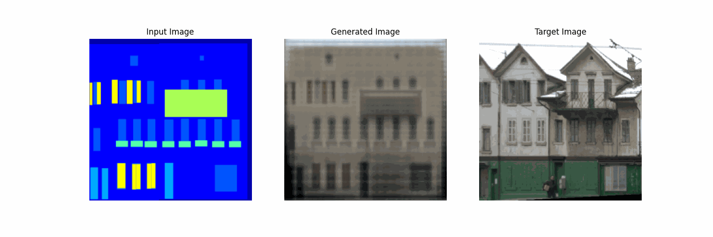

# Facade Generator GAN

This project implements a GAN (Generative Adversarial Network) for generating realistic building facades from segmented images. It uses a Pix2Pix architecture with U-Net as the generator and PatchGAN as the discriminator.

## 🎯 Objective

Convert segmented images (simplified representations with color blocks) into photorealistic building facades.

## 🔷 Example


## 📊 Dataset

The project uses the CMP Facades dataset from Hugging Face, which contains:
- Images of real facades
- Their corresponding segmentation maps
- Labels for different architectural elements (windows, doors, balconies, etc.)

## 🛠️ Project Structure

The notebook `Image_to_Image Translation GAN.ipynb` contains the following sections:

1. **Environment Setup**: Initial setup and dependencies
2. **Dataset Preparation**: Data loading and preparation
3. **Generator Architecture**: Implementation of the U-Net generator
4. **Discriminator Architecture**: Implementation of the PatchGAN discriminator
5. **Training Loop**: GAN training process
6. **Image Translation**: Functions to generate images
7. **Model Evaluation**: Evaluation and visualization of results
8. **Interactive Tool**: Tool for drawing and generating facades

## 📦 Requirements
```bash
torch
torchvision
Pillow
numpy
matplotlib
tqdm
pandas
fastparquet
pyarrow
huggingface_hub
```

## 🚀 Usage

1. **Preparation**:
   ```python
   # Install dependencies
   pip install -r requirements.txt
   ```
2. **Training**:
   - Execute the notebook cells in order
   - The training process will show generated images every 5 epochs
   - Models will be saved automatically
  
3. **Interactive Tool**:
   - The last section contains a tool for drawing segmentations
   - Use the color buttons to select elements:
      - 🟧 Wall (Salmon)
      - 🟦 Window (Sky Blue)
      - 🟫 Door (Saddle Brown)
      - 🟩 Balcony (Pale Green)
   - Click "Generate" to create the facade
   - Click "Clear" to start over

## 📊 Results
The model generates realistic facades based on:

- General structure defined by the segmentation
- Textures and details learned from the dataset
- Architectural coherence

## 🤝 Contributions
Feel free to:

- 🐛 Report bugs
- 💡 Suggest improvements
- 🔧 Add new features
- 📝 Documentation

## Author
- [Daniel Ramírez Vaquero](https://github.com/DaniRamirezVaquero)

## 📄 License
This project is licensed under the MIT License.